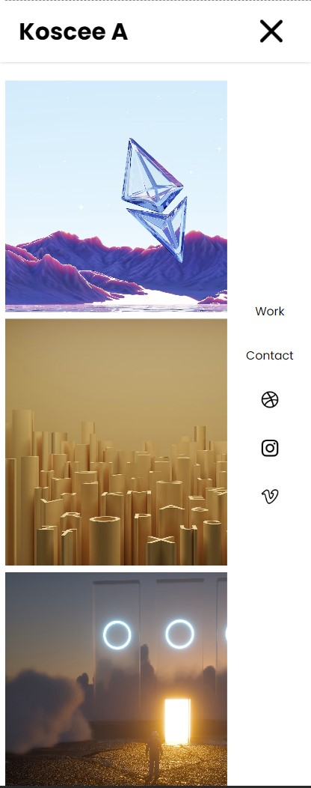

# Portfolio Page Design

## Notes

The images folder contains some `.avif` images. Most browsers don't support `.avif` images, so use a Chrome browser to open the html file.

## Screenshots

### Desktop View

### Tablet View

### Mobile View (With Sidebar Closed)

### Mobile View (With Sidebar Opened)

